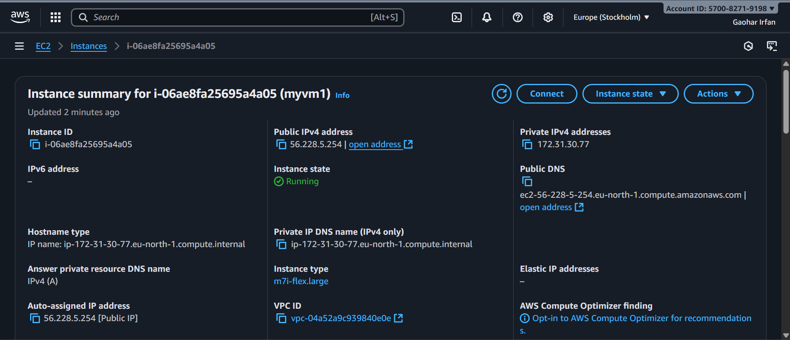
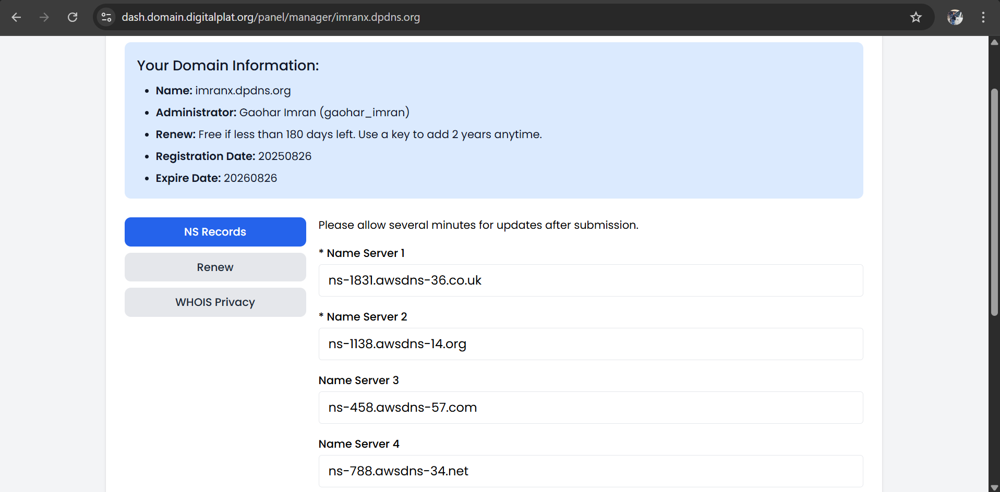
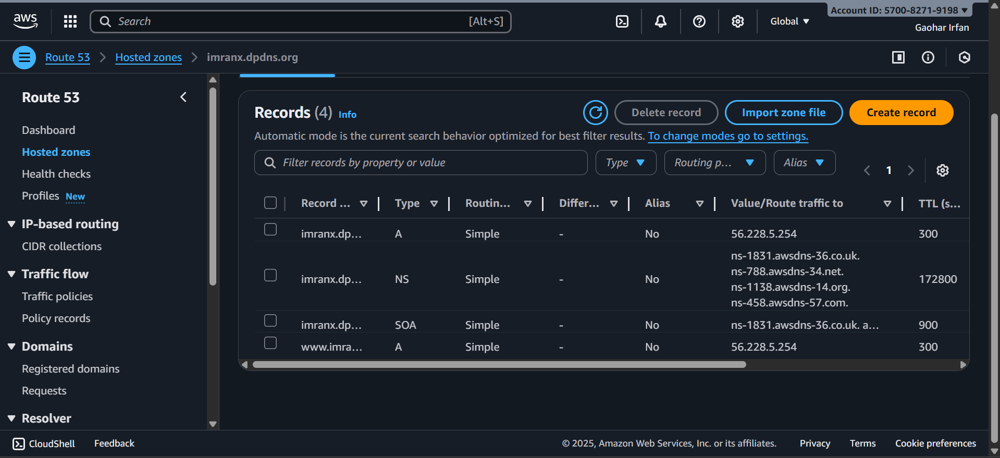
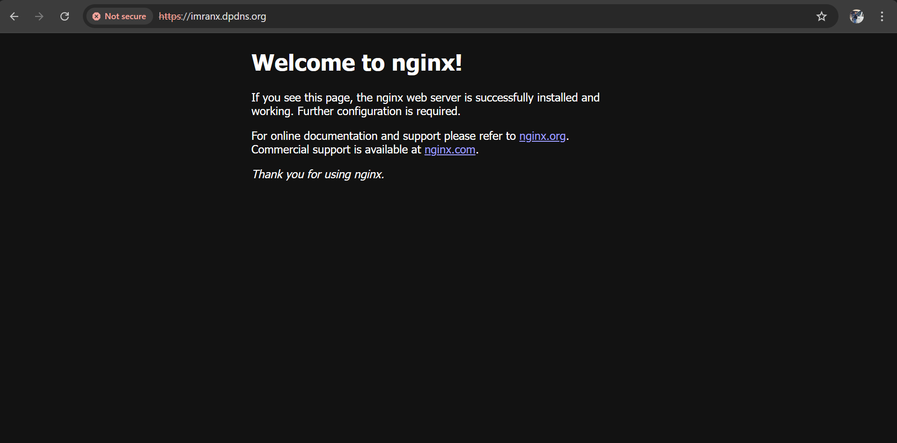
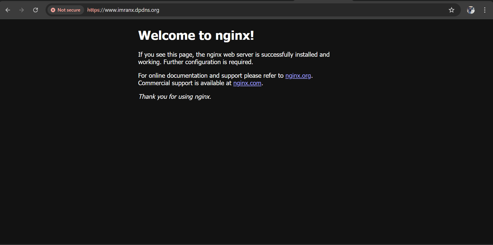
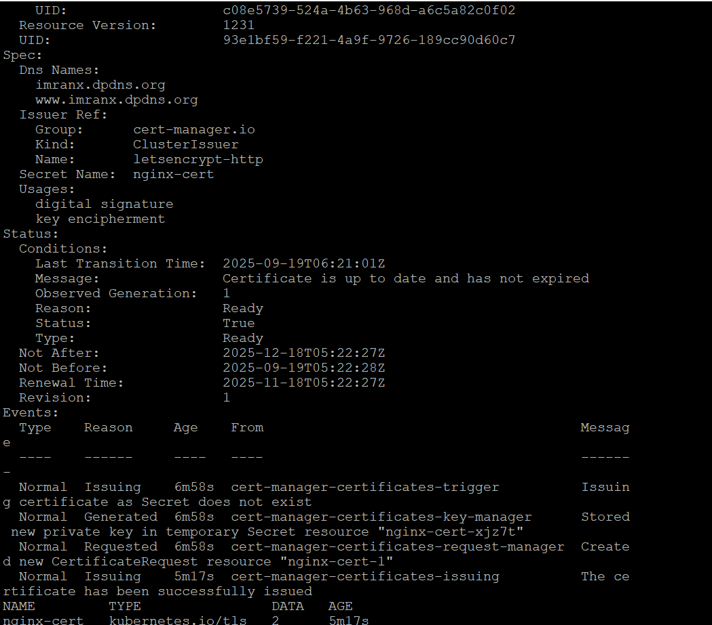
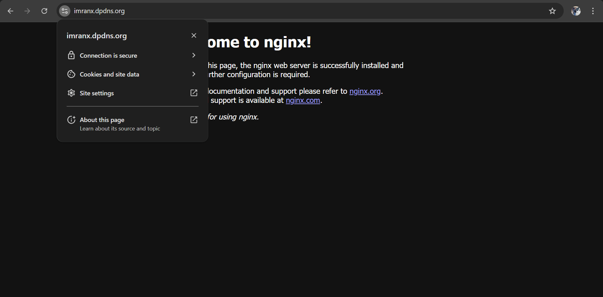

# Hosting a Website on AWS EC2 with K3S and traefik and then making it secure with let's encrypt

## Steps to Deploy

### 1. Launch EC2 Instance  
- Go to AWS Console, then EC2, then Launch Instance  
- Choose *Ubuntu*
- Choose 8gb m7fix.large
- Create and Use key pair
- Use Putty
- Allow *HTTP (80), **HTTPS (443), and **SSH (22)*  
- Launch instance
  
## Launched EC2 Instance


### 2. Connect to EC2 (using PuTTY/SSH)  
- Download Putty.exe file and install it in your device.
- Go to connection.
- Go to SSH
- Go to Auth
- Choose key pair file you made while creating instance.
bash
login as username: ubuntu

### 3. Update and upgrade 

```bash
sudo apt update
sudo apt upgrade
```

### 4. Install K3S and traefik
```bash
curl -sfL https://get.k3s.io | sh -
```
### 5. Check and make sure traefik is running

```bash
sudo kubectl get nodes
sudo kubectl get pods -n kube-system
```

### 6. Create File nginx.yaml

```bash
sudo vi nginx.yaml
```
- Press I and paste the beloew code

```bash
apiVersion: apps/v1
kind: Deployment
metadata:
  name: nginx-deployment
spec:
  replicas: 1
  selector:
    matchLabels:
      app: nginx
  template:
    metadata:
      labels:
        app: nginx
    spec:
      containers:
      - name: nginx
        image: nginx:latest
        ports:
        - containerPort: 80
---
apiVersion: v1
kind: Service
metadata:
  name: nginx-service
spec:
  selector:
    app: nginx
  ports:
  - port: 80
    targetPort: 80
```
- Press Ctrl+C and then type ":wq" and press Enter
- Apply the above file
  
```bash
sudo kubectl apply -f nginx.yaml
```

### 7. Create file ingress.yaml

```bash
sudo vi ingress.yaml
```
- Press I and paste the below code

```bash
apiVersion: networking.k8s.io/v1
kind: Ingress
metadata:
  name: nginx-ingress
spec:
  ingressClassName: traefik
  rules:
  - http:
      paths:
      - path: /
        pathType: Prefix
        backend:
          service:
            name: nginx-service
            port:
              number: 80
```
- Press Ctrl+C and then type ":wq" and press Enter
- Apply the above file
  
```bash
sudo kubectl apply -f ingress.yaml
```
- To check browse your EC2 public ip in browser if nginx page is showing then it means its working.


### 8. Map Domain with Route 53  

- Register your own domain name.
- Go to Route 53 on AWS, Click on Hosted Zones.
- You will get four NS name server.
- Then update these name server in your domain.



- Create two records in route 53 hosted zone
  


- First record subdomain should be blank to point route domain.
- Second record subdomain should be www .
- Set your domain, Enter your allotted Public IP and then Map it.
- To check , browse your domain name in browser if nginx page is showing then it means its working.




# Making it secure 

### 9. Install cert-manager

```bash
sudo kubectl apply -f https://github.com/cert-manager/cert-manager/releases/download/v1.14.4/cert-manager.yaml
```
- Check cert-manager in pods

```bash
sudo kubectl get pods -n cert-manager
```

### 10. Create a file cluster-issuer.yaml

```bash
sudo vi cluster-issuer.yaml
```
- Press I and paste the below code
- Add your email id to manage certificates in below code

```bash
apiVersion: cert-manager.io/v1
kind: ClusterIssuer
metadata:
  name: letsencrypt-http
spec:
  acme:
    email: your-email@example.com  # <-- replace with your email
    server: https://acme-v02.api.letsencrypt.org/directory
    privateKeySecretRef:
      name: letsencrypt-http-key
    solvers:
    - http01:
        ingress:
          class: traefik
```
- Press Ctrl+C and then type ":wq" and press Enter
- Apply the above file

```bash
sudo kubectl apply -f cluster-issuer.yaml
```

### 11. Edit you nginx-ingress.yaml for domain names

```bash
sudo vi nginx-ingress.yaml
```
- Press I and paste the below code
- Edit your domain and subdomain name in below code

```bash
apiVersion: networking.k8s.io/v1
kind: Ingress
metadata:
  name: nginx-ingress
  annotations:
    cert-manager.io/cluster-issuer: "letsencrypt-http"
spec:
  rules:
  - host: imranx.dpdns.org
    http:
      paths:
      - path: /
        pathType: Prefix
        backend:
          service:
            name: nginx-service
            port:
              number: 80
  - host: www.imranx.dpdns.org
    http:
      paths:
      - path: /
        pathType: Prefix
        backend:
          service:
            name: nginx-service
            port:
              number: 80
  tls:
  - hosts:
    - imranx.dpdns.org
    - www.imranx.dpdns.org
    secretName: nginx-cert
```
- Press Ctrl+C and then type ":wq" and press Enter
- Apply the above file

```bash
sudo kubectl apply -f ingress.yaml
```

### 12. Create a file certificates.yaml

```bash
sudo vi cerificates.yaml
````
- Press I and paste the below code
- Edit your domain and subdomain name in below code
  
```bash
apiVersion: cert-manager.io/v1
kind: Certificate
metadata:
  name: nginx-cert
  namespace: default
spec:
  secretName: nginx-cert
  dnsNames:
  - imranx.dpdns.org
  - www.imranx.dpdns.org
  issuerRef:
    name: letsencrypt-http
    kind: ClusterIssuer
```

- Press Ctrl+C and then type ":wq" and press Enter
- Apply the above file
  
```bash
sudo kubectl apply -f certificates.yaml
```

### Verfiy that certfiicate get generated

```bash
sudo kubectl get certificate
sudo kubectl describe certificate nginx-cert
sudo kubectl get secret nginx-cert
```
- It will show like this



- Now browse you domain and subdomain and you will see both gets secured


